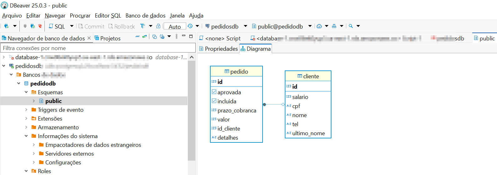

"# Java-Streams" 


````bash
docker run -d -p 5672:5672 -p 15672:15672 --name my-rabbit rabbitmq:3-management
````

```bash
docker run --name postgres-container -d -e POSTGRES_USER=user -e POSTGRES_PASSWORD=passwd -e POSTGRES_DB=pedidosdb -p 5433:5432 postgres
```


